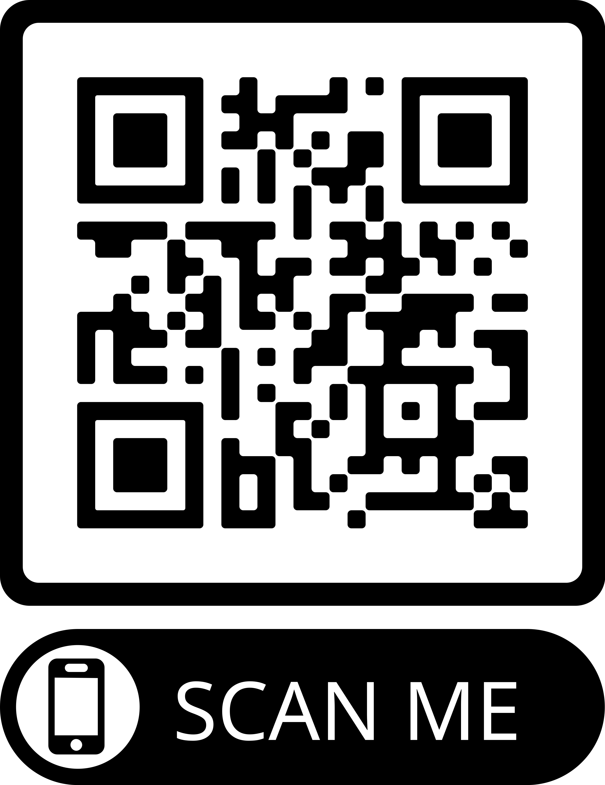
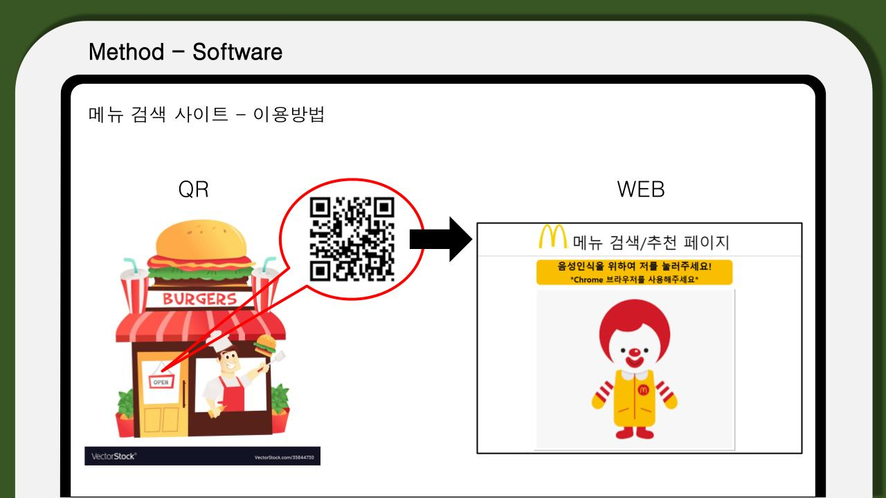

## 🚀 결과

+ [메뉴 검색 사이트](https://findmenu.netlify.app) 으로 들어가면 볼 수 있다. netlify를 통해 무료로 웹 서버를 구축하여 올릴 수 있었다.

+ 1. QR코드를 찍으면 이 사이트로 연결된다.  
    
  
   

  
  
 

+ 2. 첫 기획 디자인
  
  .jpg)

  + 캐릭터를 누르면 음성인식을 시작하고, 입력받은 음성을 문자로 바꿔 확인한다. 다음으로 넘어가면 해당 문자열을 포함하는 관련 메뉴들이 출력된다.

 

+ 3. 모바일로 웹사이트에 접속한 모습
  
  .jpg)

  + 아쉽게도 웹을 구현할 때 사용한 api는 크롬에서 제공하는 음성인식 api로 크롬에서만 사용할 수 있다. 
  
 

+ 4. 구현
  
  .jpg)

  + 디자인에 공을 들이지 않아서 금방 할 수 있었다. 위 그림처럼 메우 간단하게 만들었다. 공백이 없는 빽빽한 정보량은 고령층이 한눈에 보기 어렵기 때문이다.
  
 

+ 5. 구현
  
  .jpg)

  + 입력받은 음성데이터는 문자열로 변환해 로컬 스토리지에 저장하여 다음 창으로 넘어갔을 때, 불러와 사용할 수 있도록 했다. 

 

